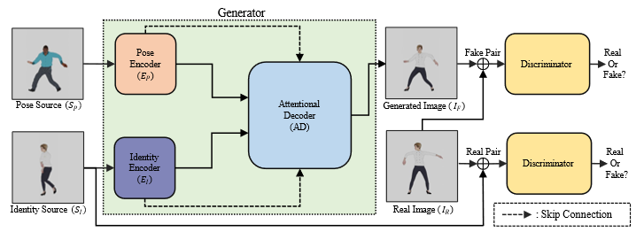

# CaPTURe: Cartoon Pose Transfer Using Reverse Attention

[Project Page](https://anchang8.github.io/CaPTURe_Demo/)

This repository contains the implementation for '[CaPTURe: Cartoon Pose Transfer Using Reverse Attention](https://www.sciencedirect.com/science/article/abs/pii/S0925231223007427?via%3Dihub)', An and Choi, Nuerocomputing, 2023




**CaPTURe** is an image-based pose trasnfer network that address the limitations of the previous pose transfer methods. The limitations include that the previous networks have to use joint keypoints of target pose by pre-trained pose estimation network on the human domain.

## Prerequisites
- python 3.8+
- pytorch 1.8.1+
- sconf, pillow

Dataset: 
- [Fashion Video Dataset](https://vision.cs.ubc.ca/datasets/fashion/)(download the data and put both 'train' and 'test' directory into the 'Fashion_dataset' directory)
- [Mixamo](https://www.mixamo.com/#/)(download the 3D video, render it to 2D, and save as follows.)
    - Dataset tree:
        ```bash
            |-- CaPTURe
                |-- Mixamo_dataset
                    |-- train
                    |    |-- (Character Name)
                    |        |-- (Video Name)
                    |            |-- imgs
                    |-- test
                        |-- imgs
        ```

## Usage
### Train
To train **CaPTURe** on Fashion Video Dataset:
```
python train.py defaults.yaml --result_title Fashion
``` 

To train **CaPTURe** on Mixamo Dataset:
```
python train.py defaults.yaml --dataset_path Mixamo_dataset --result_title Mixamo
``` 
### Inference
```
python save_result.py {model directory for inference ex.)result/Fashion} --iden_path {target identity img} --pose_path {target pose img} --save_dir {save directory}
```

## Results
### Fashion Video Dataset
#### Qualitative results

### Mixamo Dataset
#### Quantitative results
| Method | L1(↓) | SSIM(↑) | LPIPS(↓) | FID(↓) |
| - | - | - | - | - |
| [LWGAN](https://arxiv.org/abs/1909.12224) | 0.1834 | 0.8437 | 0.1851 | 36.0141 |
| [FOMM](https://papers.nips.cc/paper_files/paper/2019/hash/31c0b36aef265d9221af80872ceb62f9-Abstract.html) | 0.0153 | 0.9275 | 0.0554 | 12.4067 |
| [MOAA](https://arxiv.org/abs/2104.11280) | 0.0149 | 0.9285 | 0.0516 | **11.9238** |
| CaPTURe(Ours) | **0.0142** | **0.9294** | **0.0512** | 15.0124 |
#### Qualitative result

